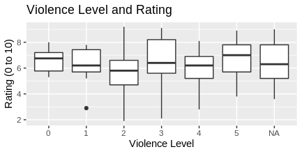
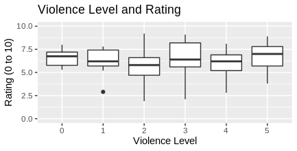
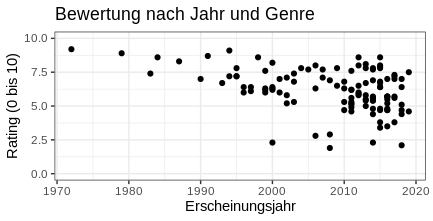

# Auswertung der Filmdatenbank mit R

Zunächst müssen wir aus R heraus eine Verbindung zu unserer Datenbank aufbauen. Dazu brauchen wir im Fall von MariaDB zwei Libraries:

```R
library('DBI')
library('RMariaDB')
```

Da wir die Daten später visualisieren wollen, laden wir ggplot2:

```R
library('ggplot2')
```

Dann laden wir noch `tidyverse`, weil es hilfreiche Bibliotheken zum Umgang mit Daten wie `dplyr` enthält:

```R
library('tidyverse')
```

Nun können wir ein Verbindungsobjekt, hier `con` genannt, erzeugen. Mit diesem schicken wir später Befehle an die Datenbank.

```R
con <- dbConnect(RMariaDB::MariaDB(),
                 dbname = "movies",
                 username ="user",
                 password = "",
                 # Die Datenbank befindet sich
                 # auf dem gleichen Rechner,
                 # aber hier IP statt localhost:
                 host = '127.0.0.1',
                 port = 3306)
```

Wenn Sie das mit Ihrem Kursaccount nachvollziehen möchten, müssen Sie die Daten entsprechend anpassen.

## Abfrage der Datenbank

Zunächst schreiben wir eine ganz normale SQL-Query:
```R
queryGetFilms = "SELECT year,
                        titleEn,
                        myRating,
                        ratingSiteAvg,
                        violence,
                        primaryGenre as genre
                        FROM movies.film
                        WHERE myRating IS NOT NULL AND
                        ratingSiteAvg is NOT NULL";
```

Dann schicken wir sie an die Datenbank und laden das Ergebnis herunter:

```R
# Query abschicken und das Resultset benennen:
rs = dbSendQuery(con, queryGetFilms);

# Das Ergebnis abrufen und in einer
# Dataframe speichern
# (dbFetch, weil fetch deprecated ist!)
movies = dbFetch(rs, -1);
```

## Erste Analyse: Zusammenhang zwischen Gewalt und Rating?

Viele Filem sind weitgehend gewaltfrei, aber in einigen Genres wie "Action" oder "Crime" ist die Darstellung von Gewalt üblich und oft sogar ein wichtiges Element des Plot. Gibt es möglicherweise einen Zusammenhang zum Rating?

In der Datenbank ist "Gewalt" in Form von fünf Gruppen erfasst. Deshalb bietet sich ein vergleich in Form eines Boxplot an:

```R
# Plot vorbereiten
ViolenceVsRating <- ggplot(movies) +
  geom_boxplot(aes(x=as.factor(violence), y=ratingSiteAvg)) +
  ggtitle('Violence Level and Rating') +
  xlab('Violence Level') +
  ylab('Rating (0 to 10)')

# Plot ausgeben
ViolenceVsRating
```



Das Ergebnis hat mehrere Probleme:
1. Die Y-Achse beginnt nicht bei 0.
2. Die Gruppe NA ist enthalten.
3. Es ist nicht ersichtlich, ob die einzelnen Gruppen groß genug sind für eine sinnvolle Aussage.

Die letzte Frage können wir mit einer Zeile R beantworten:

```R
table(movies$violence, useNA = "ifany")
```

```
   0    1    2    3    4    5 <NA>
  10   12   29   21   30   31   32
```

Alle Gruppen sind ziemlich klein, weil wir nur eine geringe Anzahl Filme erfasst haben. Da Ergebnis könnte bei einer größeren Anzahl Filme deutlich anders aussehen.

Um Einträge mit ohne verfügbaren Wert (also `NA` = not available) los zu werden, haben wir zwei Möglichkeiten. Die erste besteht darin in R zu filtern:
```R
movies <- movies %>% dplyr::filter(!is.na(violence))
```

Besser wäre es die SQL-Query anzupassen. Also ergänzen wir `queryGetFilms` um `AND violence IS NOT NULL` und laden neu.

```R
queryGetFilms = "SELECT year,
                        titleEn,
                        myRating,
                        ratingSiteAvg,
                        violence,
                        primaryGenre as genre
                        FROM movies.film
                        WHERE myRating IS NOT NULL AND
                        ratingSiteAvg is NOT NULL
                        AND violence IS NOT NULL";
```

Damit bleibt das Problem, dass die y-Achse nicht bei 0 anfängt. Auch das lässt sich in einer Zeile lösen indem wir `ylim` mit dem Range als Argument ergänzen:

```R
# Plot vorbereiten
ViolenceVsRating <- ggplot(movies) +
  geom_boxplot(aes(x=as.factor(violence), y=ratingSiteAvg)) +
  ylim(0, 10) +  # <= NEU
  ggtitle('Violence Level and Rating') +
  xlab('Violence Level') +
  ylab('Rating (0 to 10)')

# Plot ausgeben
ViolenceVsRating
```



Wegen der geringen Zahl der vorliegenden Einträge ist es nicht angeraten einen Zusammenhang zu konstruieren.

## War früher Alles besser?

Erstellen wir einen einfachen Scatterplot der Daten:

```R
ratingByYear <- ggplot() +
  geom_point(data = movies,
             aes(x = year,
                 y = ratingSiteAvg)
             ) +
  ylim(0, 10) +
  ggtitle('Bewertung nach Jahr und Genre') +
  xlab('Erscheinungsjahr') +
  ylab('Rating (0 bis 10)') +
  theme_bw()

ratingByYear
```



Dieser Scatterplot *suggeriert* alte Filme waren besser. Aber es fällt sofort auf, dass mehr junge als alte Filme im Datensatz enthalten sind.

In unserem Datensatz sind Filme enthalten, die in den letzten Jahren gesehen und bewertet wurden. Die wahrscheinliche Erklärung ist, dass viele alte Filme in den Archiven verschwunden sind - mit der Ausnahme besonders guter Filme. Der Scatterplot zeigt uns hier also nur den selection bias im Datensatz.